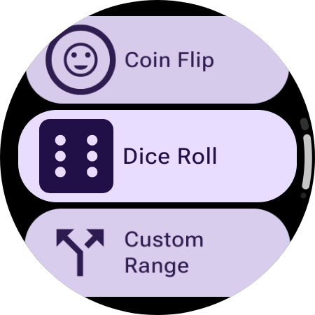
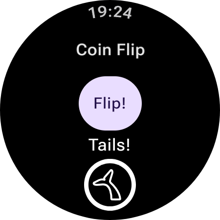
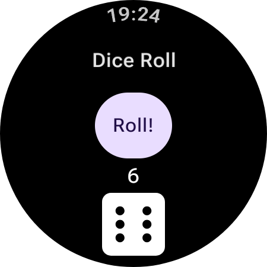
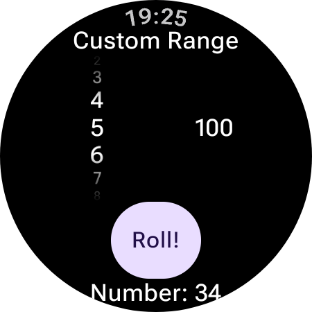

# RNG

RNG is a WearOS exclusive app that lets users digitally:

- Flip a coin
- Roll a die
- Generate random numbers in a custom range

## How to install

**What you need:**
- A wearOS watch
- A computer
- A Wi-fi network that both the watch and the computer can join
- ADB installed on the computer (the guide includes how to do so)

### Step 1: Install ADB

*Skip this step if you already have ADB installed, which is probably the case if you have android studio*

Download ADB here:
https://developer.android.com/tools/releases/platform-tools

After following the install process, check if ADB is installed by running the following command:
```bash
adb version
```

### Step 2: Enable Developer options

1. Open settings on the watch
2. Go to system
3. About
4. Build Number
5. Tap it 7 times
6. You should see message saying developer options are enabled

### Step 3: Enable ADB debugging

1. On the watch, open settings
2. Go to developer options
3. Turn on ADB debugging

### Step 4: Connect the watch to Wi-Fi if you haven't already

You may have to enable Wi-Fi in the quick options menu.

### Step 5: Connect ADB to the watch

1. Go to developer options
2. Open wireless debugging and enable it
3. Tap pair new device. You wil see an IP address, port and a pairing code
4. On your computer run:
```bash
adb pair <IP address>:<Port>
```
5. Then enter the pairing code you see
6. Then connect using the connection port shown in Wireless debugging, not the pairing port
```bash
adb connect <IP address>:<Port in Wireless Debugging>
```

### Step 7:

Confirm watch is connected by running:

```bash
adb devices
```

### Step 8: Install the APK

Download the APK from the Releases section on the Github repository, then navigate to it in the terminal.

Making sure the device is on and the screen hasnt shut off run:

```bash
adb install app-release-v1.2.apk
```
(or whatever version the app is currently on)

### Step 9: Open it

It should now be installed on your watch! Go to the apps list and check it out!


## Screenshots









## AI disclosure

Used ChatGPT, Claude for debugging, actual code was written by me though. Android Studio agent was used to add some F-droid metadata and exclude libraries that would be marked as "anti-features" by Fdroid.
